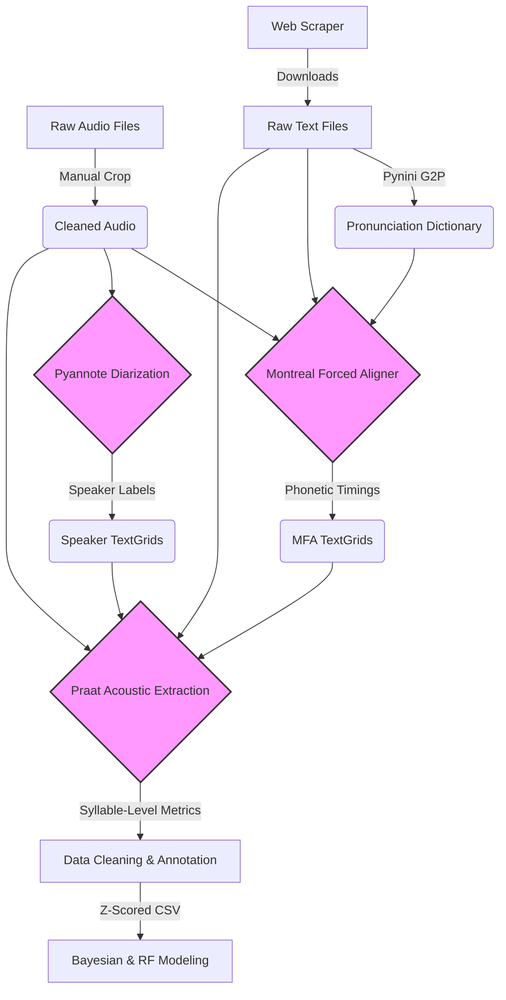

# Acoustic Correlates of Lexical Prominence in Yine

**A computational pipeline for analyzing prosodic prominence in a low-resource Amazonian language.**

## 📌 Project Overview

This repository contains the end-to-end data processing and statistical analysis pipeline used to investigate the acoustic realization of lexical prominence in **Yine** (Arawak, Peru). 

The project addresses two primary objectives:
1. **Acoustic Signature:** Determining the cue weighting hierarchy of lexical prominence in Yine (i.e., establishing whether the language relies primarily on fundamental frequency, duration, spectral balance, or intensity to signal prominence, while controlling for phrase-level intonation).
2. **Structural Controversy:** Adjudicating a specific linguistic debate regarding whether Yine possesses a rhythmic secondary stress system (Matteson, 1963) or if secondary prominence is empirically inconsistent (Hanson, 2010). 

Using a corpus of ~15 hours of read speech, this pipeline automates the extraction of acoustic features and applies advanced statistical modeling to resolve these theoretical questions.

### Key Features
*   **Automated Data Acquisition:** Scrapes and structures text corpora from digital archives.
*   **Low-Resource NLP:** Implements rule-based Grapheme-to-Phoneme (G2P) conversion using **Pynini** (Finite State Transducers).
*   **Speaker Diarization:** Utilizes **Pyannote.audio** to segment multi-speaker audio files and handle overlaps.
*   **Acoustic Extraction:** Automates **Praat/Parselmouth** to extract pitch, intensity, duration, and formant trajectories.
*   **Cross-Language Orchestration:** A hybrid Python/R pipeline that dynamically generates R scripts to run **Bayesian Multilevel Models (`brms`)** and **Conditional Random Forests (`partykit`)**.

## 🏗️ Architecture

The pipeline is modularized into discrete stages, separating data engineering from statistical inference.



## 📂 Repository Structure

```text
yine-acoustic-prominence/
├── data/                  # Local data storage (Not synced to GitHub)
├── notebooks/             # Statistical Analysis & Visualization
│   └── 01_statistical_analysis.ipynb
├── scripts/               # Executable pipeline steps
│   ├── 01_scrape_corpus.py
│   ├── 02_build_dictionary.py
│   ├── 03_diarize_audio.py
│   ├── 04_extract_metrics.py
│   └── 05_prep_statistics.py
├── src/                   # Shared libraries
│   ├── phonetics.py       # Pynini G2P rules and FSTs
│   └── syllabification.py # Custom Yine phonotactic logic
├── README.md
└── requirements.txt       # Python dependencies
```

## 🛠️ Installation

This project requires a Linux environment (or WSL on Windows) due to dependencies on `pynini` (C++ FST bindings).

1.  **Clone the repository:**
    ```bash
    git clone https://github.com/hectorgonalv/yine-acoustic-stress.git
    cd yine-acoustic-stress
    ```

2.  **Create the Conda environment:**
    ```bash
    conda create -n yine_env python=3.9 -y
    conda activate yine_env
    ```

3.  **Install dependencies:**
    ```bash
    # Install Pynini via Conda (required for Linux binaries)
    conda install -c conda-forge pynini -y
    
    # Install Python packages
    pip install -r requirements.txt
    ```

## 🚀 Usage

The pipeline is designed to be run sequentially.

**1. Data Scraping**
Downloads the Yine New Testament text corpus.
```bash
python scripts/01_scrape_corpus.py --output_dir ./data/raw
```

**2. Dictionary Generation**
Builds the pronunciation dictionary using FST rules defined in `src/phonetics.py`.
```bash
python scripts/02_build_dictionary.py --input_dir ./data/raw --output_file ./data/processed/Yine_prondict.txt
```

**3. Speaker Diarization**
Processes raw audio to detect speech segments and handle overlaps using `pyannote.audio`.
```bash
python scripts/03_diarize_audio.py --input_dir ./data/raw --output_dir ./data/processed
```

**4. Acoustic Extraction**
Aligns text, audio, and diarization data to extract vowel-level acoustic metrics (F0, Intensity, Formants, Duration).
```bash
python scripts/04_extract_metrics.py --txt_dir ./data/raw --wav_dir ./data/raw --mfa_dir ./data/mfa_alignments --diarize_dir ./data/processed --output ./data/processed/yine_metrics.csv
```

**5. Statistical Preparation**
Cleans data, filters outliers, applies Matteson's structural rules, and standardizes variables.
```bash
python scripts/05_prep_statistics.py --input_csv ./data/processed/yine_metrics.csv --output_csv ./data/processed/yine_stats_metrics.csv
```

**6. Modeling**
Open `notebooks/01_statistical_analysis.ipynb` to run the Bayesian (`brms`) and Random Forest (`partykit`) models.

## 📊 Key Findings

*   **Primary Lexical Prominence:** Confirmed as fixed on the penultimate syllable. Acoustically, it is realized primarily through **Fundamental Frequency (F0)** ($\beta = 1.21$), which significantly outperforms Duration ($\beta = 0.45$). This suggests Yine aligns with pitch-accent typologies (like Iñapari) rather than dynamic stress systems.
*   **Secondary Prominence:** Bayesian models detected weak baseline increases in both F0 and duration for alternating syllables. However, **Conditional Random Forest** classification failed to reliably distinguish these secondary prominences from unstressed syllables based on sound alone (Sensitivity < 8%). This supports the hypothesis that secondary prominence in Yine is likely a post-grammatical rhythmic tendency rather than a robust, distinct phonological category.

## ⚠️ Data Privacy Note

Due to ethical considerations regarding Indigenous Data Sovereignty, the raw audio recordings and full text corpus of the Yine language are not included in this repository. The scripts are provided for reproducibility and transparency. Users wishing to replicate this study must obtain access to the corpus from the original custodians (Bible.is) or appropriate archives.

## 📜 License

This code is released under the MIT License.
```